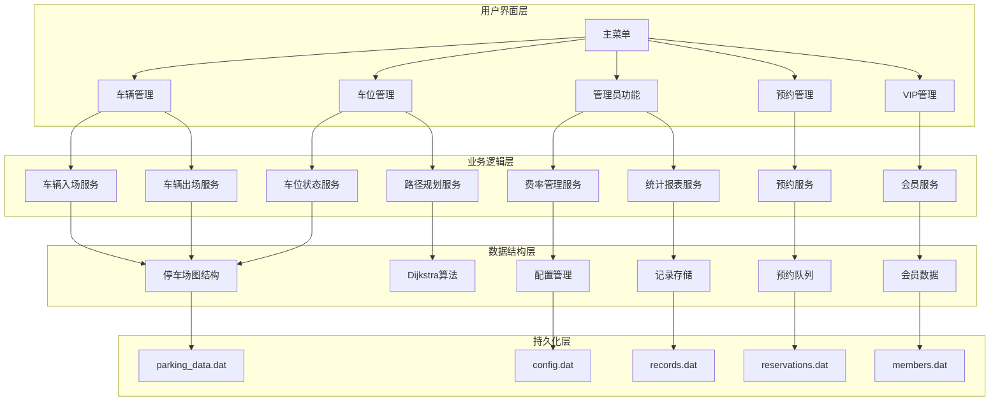
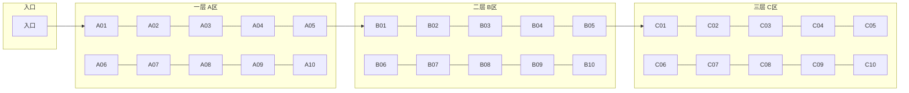
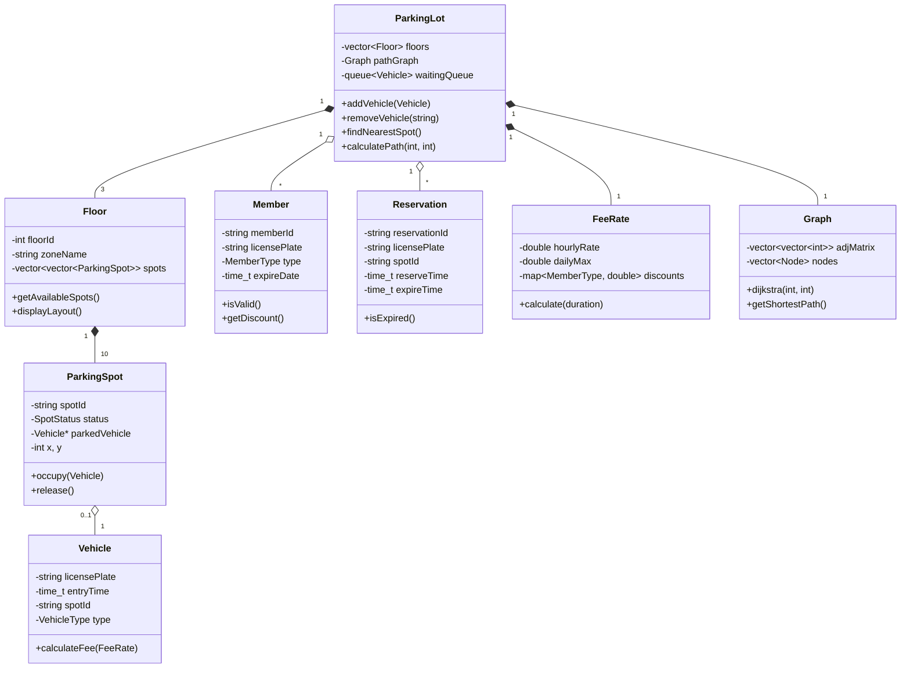

# 智能停车场管理系统 - 项目设计文档

## 1. 系统架构



## 2. 停车场布局模型



## 3. 数据结构设计

### 3.1 核心类图



### 3.2 枚举定义

```cpp
enum class SpotStatus { AVAILABLE, OCCUPIED, RESERVED, MAINTENANCE };
enum class VehicleType { CAR, SUV, MOTORCYCLE };
enum class MemberType { NORMAL, MONTHLY, YEARLY, VIP };
```

## 4. 核心算法

### 4.1 Dijkstra 最短路径算法

用于计算从入口到目标车位的最优路径：

```
输入: 图G(V,E), 起点s, 终点t
输出: 最短路径及距离

1. 初始化距离数组 dist[], 所有节点距离设为∞, dist[s]=0
2. 初始化优先队列 PQ, 加入(0, s)
3. while PQ非空:
   a. 取出距离最小的节点u
   b. 如果u==t, 返回路径
   c. 遍历u的所有邻居v:
      - 如果 dist[u] + weight(u,v) < dist[v]:
        - 更新 dist[v]
        - 记录前驱 prev[v] = u
        - 加入PQ
4. 回溯prev[]构建路径
```

## 5. 接口清单

### 5.1 车辆管理模块
| 功能 | 函数签名 | 说明 |
|------|----------|------|
| 车辆入场 | `bool enterParking(const string& plate, VehicleType type)` | 记录入场，分配车位 |
| 车辆出场 | `double exitParking(const string& plate)` | 计费，释放车位 |
| 查询车辆 | `Vehicle* findVehicle(const string& plate)` | 根据车牌查询 |

### 5.2 车位管理模块
| 功能 | 函数签名 | 说明 |
|------|----------|------|
| 获取空位 | `vector<ParkingSpot*> getAvailableSpots()` | 返回所有空闲车位 |
| 显示布局 | `void displayLayout()` | 可视化显示车位状态 |
| 路径引导 | `vector<string> getOptimalPath(const string& spotId)` | Dijkstra计算最优路径 |

### 5.3 管理员模块
| 功能 | 函数签名 | 说明 |
|------|----------|------|
| 设置费率 | `void setFeeRate(double hourly, double dailyMax)` | 配置计费标准 |
| 查看记录 | `vector<ParkingRecord> getRecords(time_t start, time_t end)` | 查询停车记录 |
| 统计收入 | `double getDailyIncome(time_t date)` | 统计指定日期收入 |

### 5.4 预约模块
| 功能 | 函数签名 | 说明 |
|------|----------|------|
| 创建预约 | `string createReservation(const string& plate, const string& spotId)` | 预约指定车位 |
| 取消预约 | `bool cancelReservation(const string& reservationId)` | 取消预约 |
| 查询预约 | `Reservation* getReservation(const string& plate)` | 查询预约信息 |

### 5.5 VIP管理模块
| 功能 | 函数签名 | 说明 |
|------|----------|------|
| 注册会员 | `string registerMember(const string& plate, MemberType type)` | 注册VIP |
| 续费 | `bool renewMembership(const string& memberId, int months)` | 会员续费 |
| 验证会员 | `Member* validateMember(const string& plate)` | 验证会员状态 |

## 6. UI/UX 规范

### 6.1 控制台界面设计

```
╔══════════════════════════════════════════════════════════════╗
║              🚗 智能停车场管理系统 v1.0                        ║
╠══════════════════════════════════════════════════════════════╣
║  [1] 车辆入场    [2] 车辆出场    [3] 车位查询                  ║
║  [4] 预约车位    [5] VIP管理     [6] 管理员功能                ║
║  [7] 停车场地图  [8] 路径引导    [0] 退出系统                  ║
╚══════════════════════════════════════════════════════════════╝
```

### 6.2 车位状态可视化

```
═══════════════ 一层 A区 ═══════════════
┌─────┬─────┬─────┬─────┬─────┐
│ A01 │ A02 │ A03 │ A04 │ A05 │
│ [■] │ [□] │ [□] │ [◆] │ [■] │
├─────┼─────┼─────┼─────┼─────┤
│ A06 │ A07 │ A08 │ A09 │ A10 │
│ [□] │ [■] │ [□] │ [□] │ [■] │
└─────┴─────┴─────┴─────┴─────┘

图例: [■]已占用  [□]空闲  [◆]已预约  [✕]维护中
```

### 6.3 颜色方案（ANSI转义码）

| 元素 | 颜色代码 | 用途 |
|------|----------|------|
| 标题 | `\033[1;36m` | 青色加粗 |
| 成功 | `\033[1;32m` | 绿色 |
| 警告 | `\033[1;33m` | 黄色 |
| 错误 | `\033[1;31m` | 红色 |
| 信息 | `\033[1;34m` | 蓝色 |
| 重置 | `\033[0m` | 恢复默认 |

## 7. 文件存储格式

### 7.1 数据文件结构

```
data/
├── config.dat          # 系统配置（费率等）
├── parking_state.dat   # 车位状态快照
├── records.dat         # 停车记录
├── members.dat         # 会员信息
└── reservations.dat    # 预约信息
```

### 7.2 记录格式（CSV）

```csv
# records.dat
record_id,license_plate,spot_id,entry_time,exit_time,fee,member_type
R001,京A12345,A01,1706745600,1706752800,15.00,NORMAL
R002,京B67890,B05,1706748000,1706759200,25.00,MONTHLY
```
